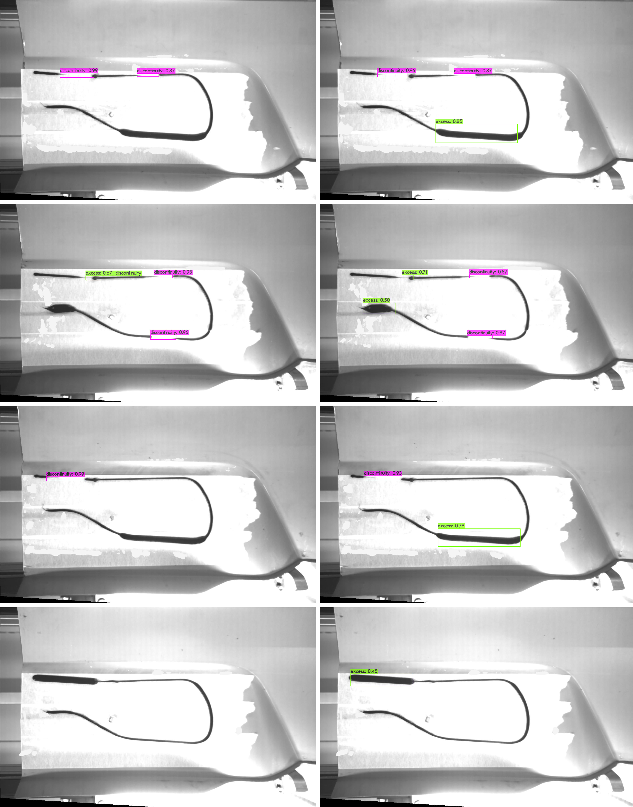

<table>
  <tr>
    <td></td>
    <td></td>
    <td></td>
    <td></td>
  </tr>
  <tr>
    <td></td>
    <td></td>
    <td></td>
    <td></td>
  </tr>
</table>

# Generative Adversarial Networks for Data Augmentation in Structural Adhesive Inspection

We leverage recent advances regarding GAN training in limited data regimes to **generate synthetic images of structural adhesive defects** such as the ones seen below. We demonstrate that these realistic synthetic samples can be **used to augmented scarce datasets and improve the performance of state-of-the-art object detection models** in the automated inspection of such adhesive applications.

## Citation 
If you use our work or data in your research please cite: 

> Peres, R.S.; Azevedo, M.; Araújo, S.O.; Guedes, M.; Miranda, F.; Barata, J. (2021). Generative Adversarial Networks for Data Augmentation in Structural Adhesive Inspection. Applied Sciences.

## Dataset
The dataset used in the paper can be found at:
https://github.com/RicardoSPeres/GAN_Synth_Adhesive/releases/latest

## Generating synthetic defect images with StyleGAN2-ADA
### Visualizing truncation traversals

In this case the seeds used were 3845 and 55832, truncation values between -1.0 and 3.0 with increments of 0.05. 

<table>
  <tr>    
    <td></td>
    <td></td>
  </tr>
</table>

## Exploring the latent space with GANSpace
### Visualizing the effect of random seeds with different truncation and scale values

<table>
  <tr>
    <td></td>
    <td></td>
    <td></td>
  </tr>
</table>

## Comparing defect detection results with YOLOv4-Tiny models trained on real and augmented datasets

<table>
  <tr>    
    <td>Real</td>    
    <td>Augmented</td>
  </tr>
</table>

<a href="#top">Back to top</a>
